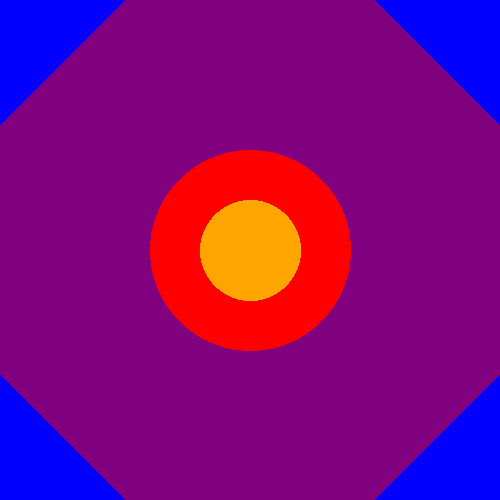
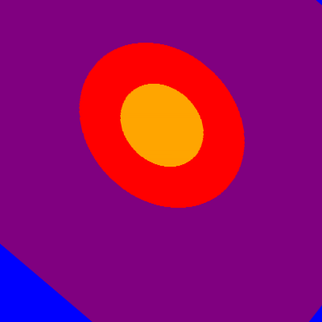

# coded-art
Below are images created from scratch by the PIL Library:

  
  
  

- `beginning`: is a simple 500x500 image.
- `distorted`:is a warped version of `beginning`.
- `constructed`: is a gif that, starting from `distorted` as a source image, constructs `beginning` utilising DL (convolutional neural network) and MSE loss.